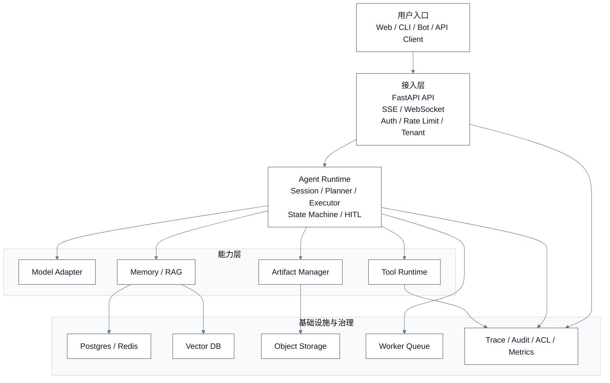
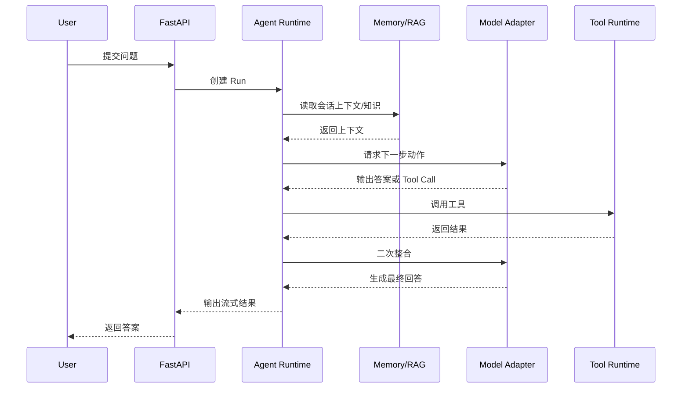
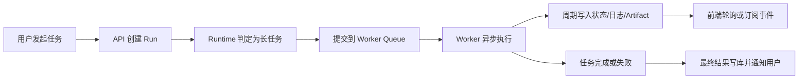
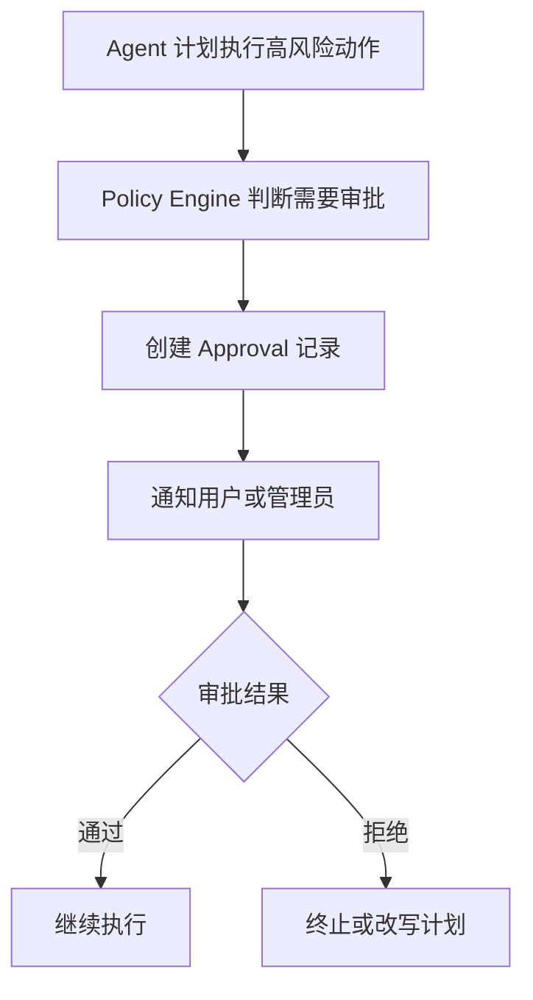
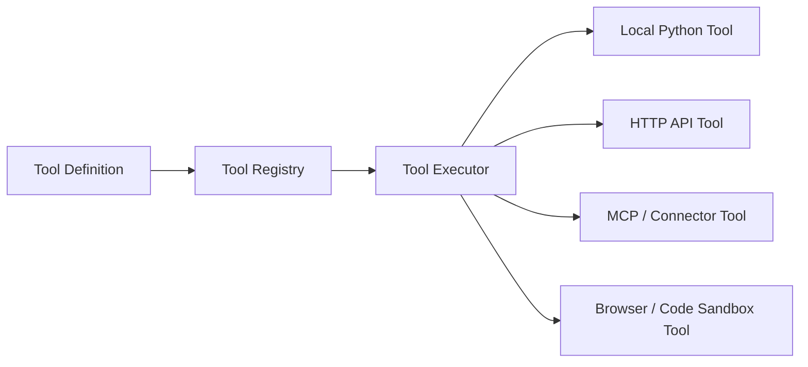
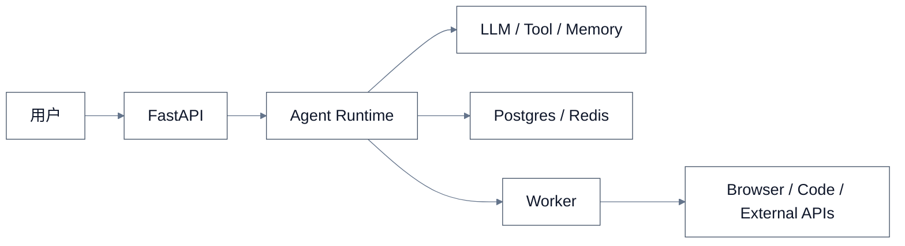
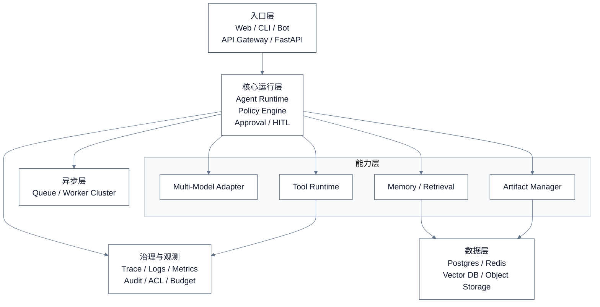

# Python Agent 应用总体架构设计

**文档标识：** `SPEC-2026-07-05-python-agent-application-design`

**文档类型：** 总体设计规格说明。

**文档作用：** 定义 Python Agent 应用的总体架构、模块边界、技术选型和演进方向。

**下游引用：**

- 阶段拆解文档：
  `docs/superpowers/plans/2026-07-05-python-agent-application-phases.md`
- 阶段 1 执行计划：
  `docs/superpowers/plans/2026-07-05-agent-runtime-execution-loop.md`

**引用关系：**

```text
SPEC 总体设计
  -> PHASES 落地阶段拆解
    -> PLAN 阶段执行计划
```

> 文档日期：2026-07-05
>
> 适用对象：希望基于 Python 从 0 到 1 搭建 Agent 应用的个人开发者、小团队或内部平台研发
>
> 设计目标：给出一套可落地、可演进、不过度设计的通用架构方案

## 文档导航

1. 先看 `0. 一页结论`，快速理解推荐架构。
2. 再看 `1. 设计目标` 和 `2. 设计原则`，明确为什么这样分层。
3. 然后看 `3. 总体架构`、`4. 核心运行链路`、`5. 模块边界`，理解系统如何跑起来。
4. 如果准备落地实现，重点看 `6. 推荐技术选型`、`7. 项目目录建议`、`8. 演进路线`。
5. 如果关注稳定性与治理，再看 `9. 安全治理`、`10. 观测与评测`、`11. 风险与边界`。

## 0. 一页结论

- 对大多数团队来说，最合适的起点不是微服务，而是 `Python 单体 + 可插拔模块 + 异步 Worker`。
- 架构重点不在“聊天界面”，而在 `Agent Runtime` 这一层：它负责上下文组装、工具调度、执行循环、状态管理和终止控制。
- 一个可维护的 Agent 应用，至少要拆清楚六层：`UI/API`、`Agent Runtime`、`Model Adapter`、`Tool Layer`、`Memory/RAG`、`Storage/Async/Observability`。
- 如果一开始就把模型 SDK、工具实现、业务逻辑、数据库访问全部耦合在一起，后面会很难扩展多模型、多工具、多任务和多租户。
- 推荐先按“单体架构”做清边界，再在出现明显瓶颈后，拆分出 `runtime`、`tool worker`、`knowledge service` 等独立服务。

## 1. 设计目标

### 1.1 要解决什么问题

基于 Python 的 Agent 应用，通常不是只做一次模型调用，而是要持续处理下面这类任务：

- 多轮对话
- 工具调用
- 文档检索与知识增强
- 长任务执行
- 人工确认与审批
- 结果落库、产物生成、可回放审计

因此，系统设计目标不是“把模型接进来”，而是“让一个带工具、带状态、可追踪的 Agent 能稳定运行”。

### 1.2 目标场景

- `Copilot 类应用`：问答、写作、代码辅助、数据分析助手
- `企业自动化 Agent`：连 Jira、Git、数据库、办公系统、内部 API
- `RAG Agent`：带知识库检索、文档问答、流程问答
- `任务型 Agent`：需要跨多个步骤、多工具、多轮决策的执行任务

## 2. 设计原则

- `单体优先`：先把边界做清楚，再决定是否拆服务
- `Runtime 优先`：Agent 的核心不是 UI，而是执行运行时
- `Tool 优先`：真正决定 Agent 上限的是工具体系，不是 prompt 数量
- `状态显式化`：执行状态、上下文、Artifact、日志都要可见
- `长任务异步化`：超过几秒的任务不要阻塞主请求链路
- `模型解耦`：不要把某一家模型供应商写死在业务层
- `默认可观测`：至少能查到每一步输入、输出、耗时、成本和错误
- `默认可治理`：高风险动作必须有权限、审批、审计和限额机制

## 3. 总体架构

## 3.1 分层总览

推荐的总体架构如下：



## 3.2 六层理解

### 第一层：用户入口层

负责承接外部请求，形态可以是：

- Web 页面
- 内部管理后台
- CLI
- Slack / 飞书 / 企业微信机器人
- 对外 API

这一层不要放复杂业务逻辑，重点是输入输出和用户体验。

### 第二层：接入层

通常由 `FastAPI` 承担，主要负责：

- 请求路由
- 鉴权与租户隔离
- 流式返回
- 会话创建
- Run 状态查询
- 限流与熔断

如果应用需要实时展示执行过程，优先使用 `SSE`；只有在需要双向交互时再引入 `WebSocket`。

### 第三层：Agent Runtime 层

这是整个系统的核心，负责：

- 组装 prompt、上下文、工具定义和模型参数
- 决定下一步动作是“思考、检索、调用工具还是结束”
- 维护执行轮次、最大步数、超时和重试策略
- 将长任务切到异步 Worker
- 在关键节点请求人工确认

可以把这一层理解成 Agent 的“执行内核”。

### 第四层：能力层

这一层聚合 Agent 可调用的核心能力：

- `Model Adapter`：接不同模型
- `Tool Runtime`：调不同工具
- `Memory/RAG`：取上下文和知识
- `Artifact Manager`：管理文件、报告、截图、表格等产物

这一层要通过清晰接口暴露能力，避免 Runtime 直接耦合底层 SDK。

### 第五层：基础设施层

负责所有持久化和异步能力：

- `Postgres`：会话、消息、任务、审计、配置
- `Redis`：缓存、幂等键、短期状态、队列中间态
- `Vector DB`：知识检索
- `Object Storage`：文件与产物
- `Worker`：长任务异步执行

### 第六层：治理与观测层

这是很多 Agent 应用前期最容易忽略，但后期最难补的一层：

- 权限控制
- 工具审批
- 审计日志
- 调用链追踪
- token / 成本统计
- 线上评测与回放

## 4. 核心运行链路

## 4.1 同步问答链路

适用于简单问答、轻量工具调用、秒级响应任务。



## 4.2 长任务链路

适用于网页抓取、批量分析、文档生成、代码执行、复杂报表等场景。



这里的关键点是：`API 层只负责接单，Worker 负责干活`。

## 4.3 人工介入链路

适用于高风险动作，例如：

- 删除数据
- 改线上配置
- 提交代码
- 调用付费 API
- 发送外部消息

推荐在 Runtime 中内建 `审批节点`：



## 5. 核心模块边界

## 5.1 Agent Runtime 内部模块

建议拆成以下几个核心对象：

| 模块                  | 职责                               |
| --------------------- | ---------------------------------- |
| `SessionManager`    | 管理用户会话、上下文窗口、会话状态 |
| `RunManager`        | 创建/恢复/终止一次执行任务         |
| `Planner`           | 生成执行计划或下一步动作           |
| `Executor`          | 执行主循环，协调模型、工具、记忆   |
| `PolicyEngine`      | 判断权限、预算、审批、风险级别     |
| `CheckpointManager` | 处理人工确认、中断恢复             |
| `ArtifactManager`   | 管理输出文件、报告、截图等产物     |

### 关键原则

- `Planner` 负责“决定做什么”
- `Executor` 负责“把决定执行掉”
- `Tool Runtime` 负责“真正调用外部能力”
- `PolicyEngine` 负责“这件事能不能做”

不要把这些职责写进一个超大 `AgentService` 里。

## 5.2 Tool Layer 模块

Tool 层建议分三块：



### Tool Definition

定义：

- 名称
- 描述
- 参数 schema
- 权限等级
- 超时
- 幂等性
- 结果格式

### Tool Registry

负责工具注册与发现。

### Tool Executor

负责：

- 参数校验
- 权限检查
- 调用执行
- 异常捕获
- 日志记录
- 结果标准化

## 5.3 Memory 模块

Memory 不要混成一个概念，建议拆为三类：

| 类型                  | 作用               | 存储位置                   |
| --------------------- | ------------------ | -------------------------- |
| `Short-term Memory` | 当前会话上下文     | Redis / Postgres           |
| `Long-term Memory`  | 用户偏好、历史事实 | Postgres                   |
| `Retrieval Memory`  | 知识文档检索       | Vector DB + Object Storage |

### 推荐做法

- 短期上下文只保留“当前任务需要的内容”
- 长期记忆只存“可复用且相对稳定的事实”
- 文档知识不要直接塞进对话历史，要通过检索动态注入

## 6. 推荐技术选型

以下是面向通用 Python Agent 应用的务实型选型建议。

| 能力域    | 推荐选型                                      | 说明                              |
| --------- | --------------------------------------------- | --------------------------------- |
| API 框架  | `FastAPI`                                   | 类型清晰，天然适合 API 和流式输出 |
| 数据校验  | `Pydantic`                                  | 适合 Tool schema 和配置对象       |
| ORM       | `SQLAlchemy` 或 `SQLModel`                | 视团队习惯而定                    |
| 数据库    | `Postgres`                                  | 通用主存储，适合会话和审计        |
| 缓存/队列 | `Redis`                                     | 缓存、分布式锁、状态中间层        |
| 异步任务  | `Celery` 或 `RQ`                          | 长任务处理                        |
| 向量库    | `pgvector` / `Milvus` / `Qdrant`        | 根据规模和部署复杂度选择          |
| 对象存储  | `S3` / `MinIO`                            | 文件和产物存储                    |
| 观测      | `OpenTelemetry` + `Langfuse` 或自建 Trace | 追踪调用链与成本                  |
| 配置管理  | `.env` + Settings 模块                      | 开发期够用，后期再接配置中心      |

### 关于 Agent 框架

如果团队要快速试验，可以使用：

- `LangGraph`
- `LlamaIndex Workflows`
- `PydanticAI`
- `AutoGen` 的部分运行模式

但建议把它们包在你自己的 `runtime adapter` 后面，不要让业务代码直接依赖框架内部抽象。否则后续迁移成本会很高。

## 7. 推荐项目目录

建议使用单体仓库、模块清晰的目录结构：

```text
app/
  api/
    routes/
    schemas/
    middleware/
  agent/
    runtime/
    planner/
    executor/
    policy/
    session/
    checkpoints/
  models/
    llm/
    embedding/
  tools/
    registry/
    executors/
    builtin/
    connectors/
  memory/
    short_term/
    long_term/
    retrieval/
  storage/
    db/
    cache/
    vector/
    object_store/
  workers/
    tasks/
  observability/
    logging/
    tracing/
    metrics/
  security/
    auth/
    acl/
    sandbox/
  domain/
    entities/
    services/
  config/
tests/
docs/
```

### 目录设计原则

- `agent/` 只放运行时编排逻辑
- `tools/` 只放可调用能力，不放业务流程
- `domain/` 放业务规则和业务对象
- `storage/` 屏蔽底层数据库与存储细节
- `workers/` 只做异步任务编排与执行入口

## 8. 演进路线

## 8.1 第一阶段：最小可用版本

适合个人或 1 到 3 人小团队。

形态：

- FastAPI 单体服务
- 一个基础 Agent Runtime
- 若干本地 Tool
- Postgres + Redis
- 简单 RAG
- 基础日志

目标：

- 能对话
- 能调用工具
- 能查知识
- 能跑基本任务

## 8.2 第二阶段：标准生产版

适合有多用户、多任务、需要稳定运行的小团队产品。

新增：

- Worker 异步任务
- Tool 权限和审批
- 统一 Trace
- Artifact 管理
- 评测与回放
- 多模型路由

## 8.3 第三阶段：平台化版本

适合内部平台或多业务线复用。

新增：

- 多 Agent 协作
- Workflow 编排
- Tool Marketplace / Connector Center
- 多租户治理
- Prompt / Agent 版本管理
- 灰度发布与实验评估

### 一个常见误区

很多团队在第一阶段就按第三阶段做，结果是：

- 抽象过重
- 研发速度变慢
- 真实使用场景还没验证
- 技术债从“复杂平台”开始累积

所以更好的路径是：`先清边界，再做拆分`。

## 9. 安全与治理

Agent 应用相比普通 Web 应用，多了“自主调用外部能力”的风险，因此必须多加一层治理设计。

### 9.1 必须具备的治理能力

- 工具级权限控制
- 用户级配额和成本上限
- 高风险动作审批
- Prompt / 输出脱敏
- 工具调用白名单
- 外部请求超时与域名限制
- 审计日志

### 9.2 高风险工具建议隔离

以下工具不建议直接在 API 进程中执行：

- 浏览器自动化
- 代码执行
- Shell 调用
- 文件系统写入
- 外部系统变更类 API

这类能力更适合：

- 独立 Worker
- 沙箱容器
- 明确审批链

## 10. 观测与评测

## 10.1 观测目标

至少要能回答下面这些问题：

- 这次 Run 走了几步
- 每一步调用了哪个模型、哪个工具
- 哪一步耗时最长
- 哪一步失败了
- 一次任务花了多少 token 和成本
- 某次线上异常是否可回放

## 10.2 推荐埋点维度

| 维度     | 示例                                   |
| -------- | -------------------------------------- |
| 会话维度 | session_id、user_id、tenant_id         |
| 执行维度 | run_id、step_id、status、duration      |
| 模型维度 | provider、model、tokens、latency、cost |
| 工具维度 | tool_name、args、result_size、error    |
| 检索维度 | query、top_k、source_ids、hit_score    |

## 10.3 评测建议

评测不要只做最终答案评分，建议拆成三层：

- `结果层`：答案是否正确、产物是否可用
- `过程层`：是否调用了不该调用的工具、是否绕了远路
- `成本层`：是否过慢、过贵、上下文是否冗余

## 11. 风险与边界

## 11.1 这套架构不适合什么

- 超高并发的纯推理网关
- 强事务一致性的金融核心交易系统
- 没有外部工具、没有状态管理、只做一次性补全文本的小工具

如果只是做“一个简单聊天页面 + 单轮模型调用”，这套架构会偏重。

## 11.2 最容易做错的地方

- 把所有逻辑塞进一个 `chat()` 函数
- 直接把模型供应商 SDK 写进业务代码
- Tool 没有 schema、权限和超时
- 所有任务都同步执行
- 把聊天历史当成长久知识库
- 没有 Run 状态机和审计能力

## 12. 最终建议

如果目标是“基于 Python 做一个真正可持续演进的 Agent 应用”，最推荐的起步形态是：

`FastAPI + Agent Runtime + Tool Layer + Memory/RAG + Postgres/Redis + Worker`

这套结构的关键价值不是“看起来先进”，而是：

- 先把执行核心和能力边界做对
- 先支持工具、状态、异步和审计
- 先保证后续可以扩展多模型、多任务、多用户

换句话说，Agent 应用的核心不是一个聊天框，而是一套 `可编排、可追踪、可治理的运行时系统`。

---

## 附：推荐的最小版本架构图



## 附：推荐的标准版架构图


